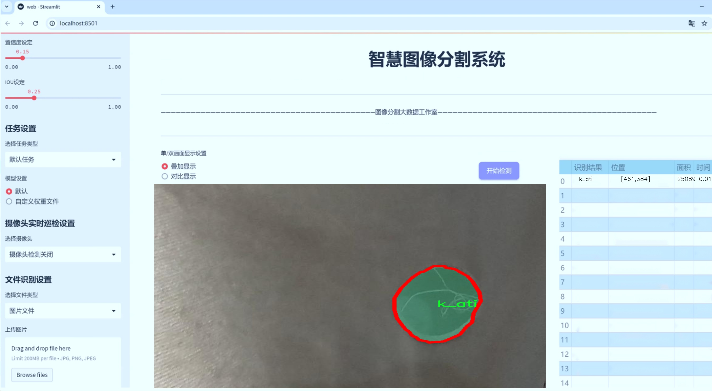
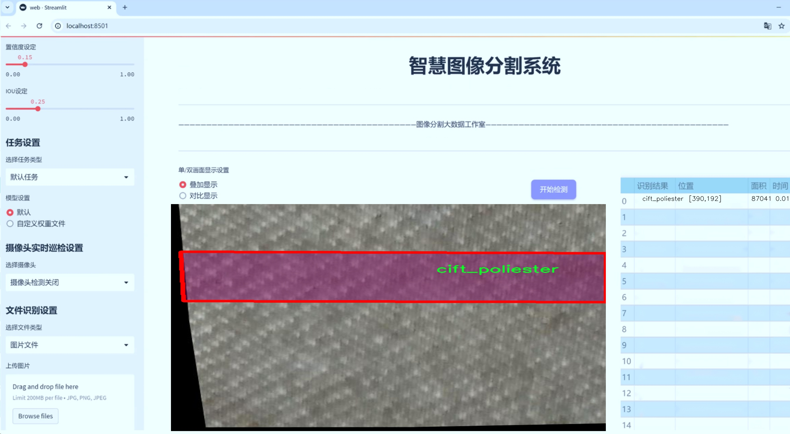
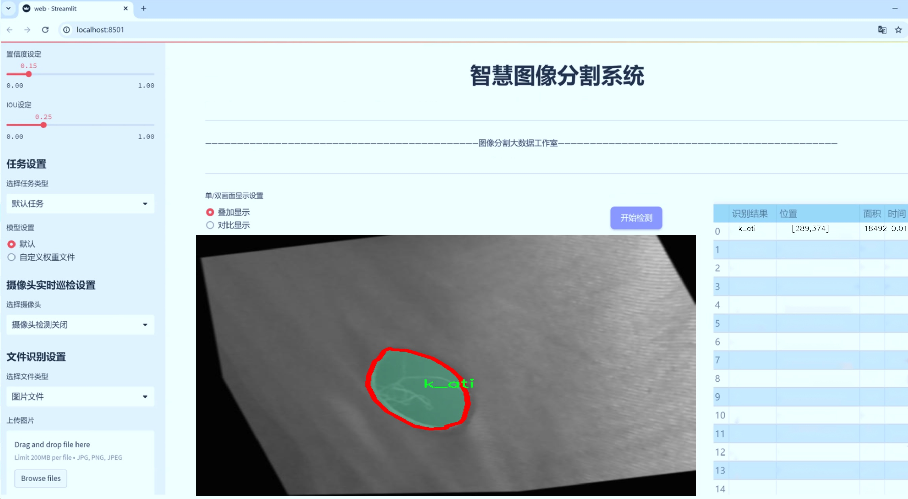
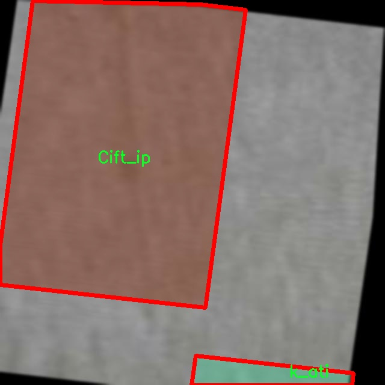
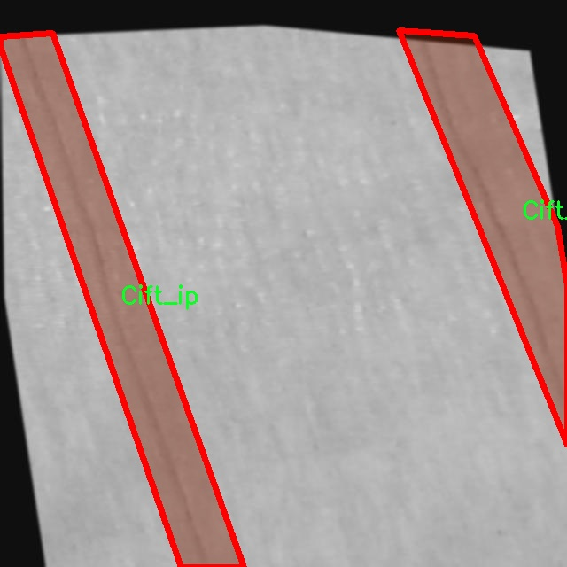
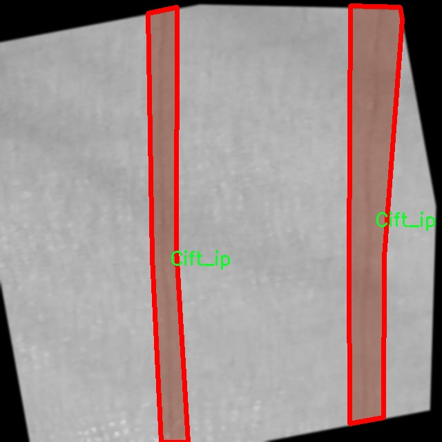
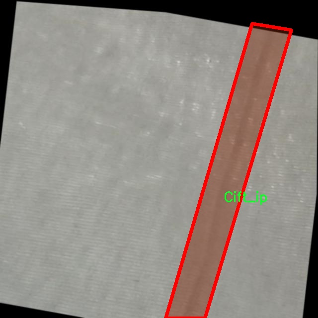
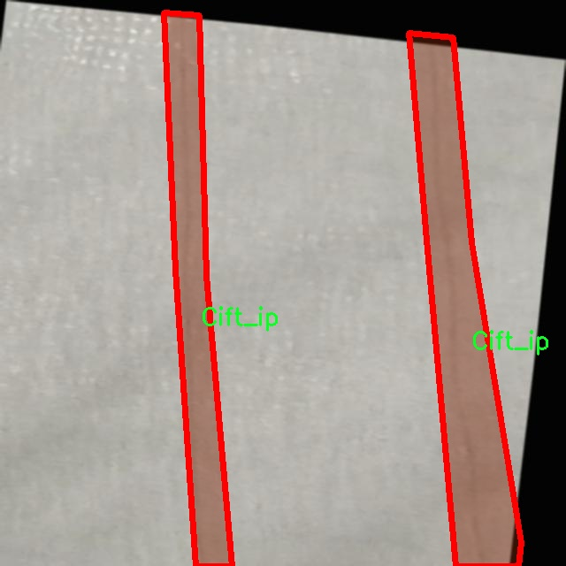

# 织物缺陷分割系统源码＆数据集分享
 [yolov8-seg-C2f-Faster-EMA＆yolov8-seg-act等50+全套改进创新点发刊_一键训练教程_Web前端展示]

### 1.研究背景与意义

项目参考[ILSVRC ImageNet Large Scale Visual Recognition Challenge](https://gitee.com/YOLOv8_YOLOv11_Segmentation_Studio/projects)

项目来源[AAAI Global Al lnnovation Contest](https://kdocs.cn/l/cszuIiCKVNis)

研究背景与意义

随着纺织工业的快速发展，织物的质量控制愈发重要。织物缺陷不仅影响产品的外观和功能，还可能导致生产效率的降低和资源的浪费。因此，开发高效的织物缺陷检测与分割系统显得尤为必要。传统的人工检测方法不仅耗时耗力，而且容易受到人为因素的影响，导致检测结果的不一致性和准确性不足。为了解决这一问题，基于深度学习的自动化检测技术逐渐成为研究的热点，其中，YOLO（You Only Look Once）系列模型因其高效的实时检测能力而受到广泛关注。

YOLOv8作为YOLO系列的最新版本，具备了更强的特征提取能力和更高的检测精度，尤其在实例分割任务中表现出色。然而，针对织物缺陷的具体应用，YOLOv8仍存在一定的局限性。织物缺陷的种类繁多，且每种缺陷的形态、颜色和纹理特征差异显著，传统的YOLOv8模型在处理这些复杂情况时可能无法达到理想的效果。因此，基于改进YOLOv8的织物缺陷分割系统的研究具有重要的现实意义。

本研究将利用一个包含1300张图像和15个类别的织物缺陷数据集，进行模型的训练与优化。该数据集涵盖了多种织物缺陷类型，如“ip_atlama”（跳线）、“ip_kopma”（断线）、“kesik”（切口）等，能够为模型提供丰富的样本支持。这些缺陷的多样性和复杂性为模型的训练提出了更高的要求，同时也为模型的泛化能力提供了良好的测试基础。通过对YOLOv8模型的改进，我们希望能够提升其在织物缺陷检测中的准确性和效率，进而实现对织物缺陷的快速、准确分割。

此外，随着人工智能技术的不断进步，深度学习在图像处理领域的应用日益广泛。织物缺陷分割系统的研究不仅能够推动纺织行业的智能化发展，还能够为其他领域的图像分割任务提供借鉴和参考。通过本研究的开展，我们希望能够为织物缺陷检测提供一种新的解决方案，推动相关技术的进步和应用。

综上所述，基于改进YOLOv8的织物缺陷分割系统的研究，不仅具有重要的理论价值，还具备广泛的应用前景。通过提升织物缺陷检测的自动化水平，我们能够有效提高生产效率，降低人工成本，同时也为企业的质量管理提供有力支持。未来，随着技术的不断进步和数据集的不断丰富，我们期待能够在织物缺陷检测领域取得更大的突破，为纺织行业的可持续发展贡献力量。

### 2.图片演示







##### 注意：由于此博客编辑较早，上面“2.图片演示”和“3.视频演示”展示的系统图片或者视频可能为老版本，新版本在老版本的基础上升级如下：（实际效果以升级的新版本为准）

  （1）适配了YOLOV8的“目标检测”模型和“实例分割”模型，通过加载相应的权重（.pt）文件即可自适应加载模型。

  （2）支持“图片识别”、“视频识别”、“摄像头实时识别”三种识别模式。

  （3）支持“图片识别”、“视频识别”、“摄像头实时识别”三种识别结果保存导出，解决手动导出（容易卡顿出现爆内存）存在的问题，识别完自动保存结果并导出到tempDir中。

  （4）支持Web前端系统中的标题、背景图等自定义修改，后面提供修改教程。

  另外本项目提供训练的数据集和训练教程,暂不提供权重文件（best.pt）,需要您按照教程进行训练后实现图片演示和Web前端界面演示的效果。

### 3.视频演示

[3.1 视频演示](https://www.bilibili.com/video/BV1mF2nY4EjY/)

### 4.数据集信息展示

##### 4.1 本项目数据集详细数据（类别数＆类别名）

nc: 15
names: ['Cift_ip', 'LYC', 'cift_poliester', 'gomuk', 'igne_kirigi', 'ilmek', 'ip_atlama', 'ip_kopma', 'k_ati', 'kelebek', 'kesik', 'kir', 'patlak', 'potyester_k', 'yag_damla']


##### 4.2 本项目数据集信息介绍

数据集信息展示

在织物缺陷检测领域，数据集的质量和多样性直接影响到模型的训练效果和实际应用性能。本研究所采用的数据集名为“Fabric defect”，其设计旨在为改进YOLOv8-seg的织物缺陷分割系统提供强有力的支持。该数据集包含15个不同的类别，涵盖了织物生产过程中可能出现的多种缺陷类型。这些类别不仅反映了织物的物理特性，还体现了在实际生产中可能遇到的各种问题，为模型的训练提供了丰富的样本。

数据集中包含的类别分别为：Cift_ip、LYC、cift_poliester、gomuk、igne_kirigi、ilmek、ip_atlama、ip_kopma、k_ati、kelebek、kesik、kir、patlak、potyester_k和yag_damla。这些类别的命名反映了不同类型的织物缺陷。例如，“Cift_ip”可能指的是织物表面出现的双线缺陷，而“ip_atlama”则可能是指在织造过程中出现的跳线现象。这些细致的分类不仅有助于模型学习识别各种缺陷，还能够在实际应用中为质量控制提供精准的指导。

数据集的构建过程遵循了严格的标准，确保每个类别都有足够的样本量，以便于模型的有效训练。每个样本都经过精心标注，确保缺陷区域的准确定位。这种高质量的标注对于YOLOv8-seg模型的训练至关重要，因为该模型依赖于精确的输入数据来优化其分割能力。此外，数据集中的样本来源于多种织物类型，涵盖了不同的颜色、纹理和材料特性，使得模型在面对实际应用时具备更强的泛化能力。

在数据集的使用过程中，研究者们将通过数据增强技术进一步丰富样本的多样性，例如对图像进行旋转、缩放、翻转等操作，以模拟不同的拍摄角度和环境条件。这些技术不仅可以提高模型的鲁棒性，还能有效减少过拟合现象的发生，从而提升模型在实际应用中的表现。

总之，“Fabric defect”数据集为改进YOLOv8-seg的织物缺陷分割系统提供了坚实的基础。通过多样化的类别设置和高质量的样本标注，该数据集不仅有助于模型的训练和优化，还能在实际生产中发挥重要作用，帮助企业提高织物质量，降低生产成本。随着研究的深入，预计该数据集将为织物缺陷检测领域的进一步发展提供更多的可能性和应用前景。











### 5.全套项目环境部署视频教程（零基础手把手教学）

[5.1 环境部署教程链接（零基础手把手教学）](https://www.bilibili.com/video/BV1jG4Ve4E9t/?vd_source=bc9aec86d164b67a7004b996143742dc)


[5.2 安装Python虚拟环境创建和依赖库安装视频教程链接（零基础手把手教学）](https://www.bilibili.com/video/BV1nA4VeYEze/?vd_source=bc9aec86d164b67a7004b996143742dc)

### 6.手把手YOLOV8-seg训练视频教程（零基础小白有手就能学会）

[6.1 手把手YOLOV8-seg训练视频教程（零基础小白有手就能学会）](https://www.bilibili.com/video/BV1cA4VeYETe/?vd_source=bc9aec86d164b67a7004b996143742dc)


按照上面的训练视频教程链接加载项目提供的数据集，运行train.py即可开始训练



     Epoch   gpu_mem       box       obj       cls    labels  img_size
     1/200     0G   0.01576   0.01955  0.007536        22      1280: 100%|██████████| 849/849 [14:42<00:00,  1.04s/it]
               Class     Images     Labels          P          R     mAP@.5 mAP@.5:.95: 100%|██████████| 213/213 [01:14<00:00,  2.87it/s]
                 all       3395      17314      0.994      0.957      0.0957      0.0843

     Epoch   gpu_mem       box       obj       cls    labels  img_size
     2/200     0G   0.01578   0.01923  0.007006        22      1280: 100%|██████████| 849/849 [14:44<00:00,  1.04s/it]
               Class     Images     Labels          P          R     mAP@.5 mAP@.5:.95: 100%|██████████| 213/213 [01:12<00:00,  2.95it/s]
                 all       3395      17314      0.996      0.956      0.0957      0.0845

     Epoch   gpu_mem       box       obj       cls    labels  img_size
     3/200     0G   0.01561    0.0191  0.006895        27      1280: 100%|██████████| 849/849 [10:56<00:00,  1.29it/s]
               Class     Images     Labels          P          R     mAP@.5 mAP@.5:.95: 100%|███████   | 187/213 [00:52<00:00,  4.04it/s]
                 all       3395      17314      0.996      0.957      0.0957      0.0845


### 7.50+种全套YOLOV8-seg创新点代码加载调参视频教程（一键加载写好的改进模型的配置文件）

[7.1 50+种全套YOLOV8-seg创新点代码加载调参视频教程（一键加载写好的改进模型的配置文件）](https://www.bilibili.com/video/BV1Hw4VePEXv/?vd_source=bc9aec86d164b67a7004b996143742dc)

### 8.YOLOV8-seg图像分割算法原理

原始YOLOv8-seg算法原理

YOLOv8-seg算法是目标检测领域的最新进展，基于YOLOv8的架构，结合了图像分割的需求，旨在提高对复杂场景中目标的检测和分割精度。该算法在YOLOv5和YOLOv7的基础上进行了多项创新，采用了更加高效的网络结构和先进的训练策略，使其在目标检测和分割任务中展现出卓越的性能。

YOLOv8-seg的网络结构依然由输入层、主干网络、特征融合层和解耦头组成。输入层负责将原始图像转换为适合网络处理的格式，通常是640x640的RGB图像。接下来，主干网络采用了CSPDarknet的设计理念，具体使用了C2f模块来替代YOLOv5中的C3模块。C2f模块的设计灵感来源于YOLOv7的ELAN结构，具有更高的特征提取能力和更丰富的梯度流信息。C2f模块通过引入多个shortcut连接，缓解了深层网络中的梯度消失问题，从而提升了模型的收敛速度和检测精度。

在特征融合层，YOLOv8-seg采用了PAN-FPN结构，这种结构通过自下而上的特征融合，充分利用了不同层次的特征信息。特征融合的过程包括将高层特征进行上采样，并与中层和浅层特征进行连接，以确保模型能够同时捕捉到细节信息和语义信息。这种多尺度特征融合的策略使得YOLOv8-seg在处理不同大小的目标时表现得更加出色。

YOLOv8-seg的解耦头部分是其另一大创新。与传统的Anchor-Based方法不同，YOLOv8-seg采用了Anchor-Free的设计理念，解耦了分类和回归任务。这样的设计不仅简化了模型的结构，还提高了模型的灵活性和适应性。解耦头的输出包括多个尺度的特征图，分别用于目标的分类和边框回归，确保了模型在多种场景下的有效性。

在损失函数的设计上，YOLOv8-seg引入了VFLLoss作为分类损失，同时结合DFLLoss和CIoULoss作为回归损失。这种损失函数的组合有效地解决了样本不平衡的问题，尤其是在处理小目标时，能够显著提高模型的学习效率和检测精度。此外，YOLOv8-seg还采用了Task-Aligned的样本匹配策略，使得训练过程更加高效。

在数据预处理方面，YOLOv8-seg延续了YOLOv5的策略，使用了多种数据增强技术，如马赛克增强、混合增强、空间扰动和颜色扰动等。这些增强手段能够有效提升模型的泛化能力，使其在不同的环境和条件下依然能够保持良好的性能。

总的来说，YOLOv8-seg算法通过引入C2f模块、PAN-FPN结构、解耦头设计以及先进的损失函数，显著提升了目标检测和分割的精度和效率。其创新的Anchor-Free策略和多尺度特征融合能力，使得YOLOv8-seg在复杂场景下的表现尤为突出，成为当前目标检测领域的一项重要技术进展。随着YOLOv8-seg的推广和应用，预计将为智能监控、自动驾驶、无人机巡检等领域带来更为广泛的应用前景。


### 9.系统功能展示（检测对象为举例，实际内容以本项目数据集为准）

图9.1.系统支持检测结果表格显示

  图9.2.系统支持置信度和IOU阈值手动调节

  图9.3.系统支持自定义加载权重文件best.pt(需要你通过步骤5中训练获得)

  图9.4.系统支持摄像头实时识别

  图9.5.系统支持图片识别

  图9.6.系统支持视频识别

  图9.7.系统支持识别结果文件自动保存

  图9.8.系统支持Excel导出检测结果数据


### 10.50+种全套YOLOV8-seg创新点原理讲解（非科班也可以轻松写刊发刊，V11版本正在科研待更新）

#### 10.1 由于篇幅限制，每个创新点的具体原理讲解就不一一展开，具体见下列网址中的创新点对应子项目的技术原理博客网址【Blog】：


[10.1 50+种全套YOLOV8-seg创新点原理讲解链接](https://gitee.com/qunmasj/good)

#### 10.2 部分改进模块原理讲解(完整的改进原理见上图和技术博客链接)【此小节的图要是加载失败请移步原始博客查看，链接：https://blog.csdn.net/cheng2333333?type=blog】
### 可变性卷积DCN简介
卷积神经网络由于其构建模块中固定的几何结构，本质上受限于模型几何变换。为了提高卷积神经网络的转换建模能力，《Deformable Convolutional Networks》作者提出了两个模块：可变形卷积（deformable convolution）和可变形RoI池（deformable RoI pooling）。这两个模块均基于用额外的偏移来增加模块中的空间采样位置以及从目标任务中学习偏移的思想，而不需要额外的监督。

第一次证明了在深度神经网络中学习密集空间变换（dense spatial transformation）对于复杂的视觉任务是有效的

视觉识别中的一个关键挑战是如何适应对象比例、姿态、视点和零件变形中的几何变化或模型几何变换。一般有两种方法实现：
1）建立具有足够期望变化的训练数据集。这通常通过增加现有的数据样本来实现，例如通过仿射变换。但是训练成本昂贵而且模型参数庞大。
2）使用变换不变（transformation-invariant）的特征和算法。比如比较有名的SIFT(尺度不变特征变换)便是这一类的代表算法。

但以上的方法有两个缺点：
1）几何变换被假定为固定的和已知的，这些先验知识被用来扩充数据，设计特征和算法。为此，这个假设阻止了对具有未知几何变换的新任务的推广，从而导致这些几何变换可能没有被正确建模。
2）对于不变特征和算法进行手动设计，对于过于复杂的变换可能是困难的或不可行的。

卷积神经网络本质上局限于模拟大型未知转换。局限性源于CNN模块的固定几何结构：卷积单元在固定位置对输入特征图进行采样；池化层以固定比率降低特征矩阵分辨率；RoI（感兴趣区域）池化层将RoI分成固定的空间箱（spatial bins）等。缺乏处理几何变换的内部机制。

这种内部机制的缺乏会导致一些问题，举个例子。同一个CNN层中所有激活单元的感受野大小是相同的，但是这是不可取的。因为不同的位置可能对应于具有不同尺度或变形的对象，所以尺度或感受野大小的自适应确定对于具有精细定位的视觉识别是渴望的。

对于这些问题，作者提出了两个模块提高CNNs对几何变换建模的能力。


deformable convolution（可变形卷积）
将2D偏移量添加到标准卷积中的常规网格采样位置，使得采样网格能够自由变形。通过额外的卷积层，从前面的特征映射中学习偏移。因此，变形采用局部、密集和自适应的方式取决于输入特征。


deformable RoI pooling（可变形RoI池化）
为先前RoI池化的常规库（bin）分区中的每个库位置（bin partition）增加了一个偏移量。类似地，偏移是从前面的特征图和感兴趣区域中学习的，从而能够对具有不同形状的对象进行自适应部件定位（adaptive part localization）。

#### Deformable Convolutional Networks
Deformable Convolution
2D卷积由两个步骤组成：
1）在输入特征图x xx上使用规则网格R RR进行采样。
2）把这些采样点乘不同权重w ww后相加。

网格R定义感受野大小和扩张程度，比如内核大小为3x3，扩张程度为1的网格R可以表示为：
R = { ( − 1 , − 1 ) , ( − 1 , 0 ) , … , ( 0 , 1 ) , ( 1 , 1 ) } R = \{(-1,-1),(-1,0),\dots,(0,1),(1,1)\}
R={(−1,−1),(−1,0),…,(0,1),(1,1)}

​
 一般为小数，使用双线性插值进行处理。（把小数坐标分解到相邻的四个整数坐标点来计算结果）


具体操作如图所示：


首先对输入特征层进行一个普通的3x3卷积处理得到偏移域（offset field）。偏移域特征图具有与输入特征图相同的空间分辨率，channels维度2N对应于N个2D（xy两个方向）偏移。其中的N是原输入特征图上所具有的N个channels，也就是输入输出channels保持不变，这里xy两个channels分别对输出特征图上的一个channels进行偏移。确定采样点后就通过与相对应的权重w点乘相加得到输出特征图上该点最终值。

前面也提到过，由于这里xy两个方向所训练出来的偏移量一般来说是一个小数，那么为了得到这个点所对应的数值，会采用双线性插值的方法，从最近的四个邻近坐标点中计算得到该偏移点的数值，公式如下：


具体推理过程见：双线性插值原理

#### Deformable RoI Poolingb
所有基于区域提议（RPN）的对象检测方法都使用RoI池话处理，将任意大小的输入矩形区域转换为固定大小的特征图。


 一般为小数，需要使用双线性插值进行处理。


具体操作如图所示：


当时看这个部分的时候觉得有些突兀，明明RoI池化会将特征层转化为固定尺寸的区域。其实，我个人觉得，这个部分与上述的可变性卷积操作是类似的。这里同样是使用了一个普通的RoI池化操作，进行一些列处理后得到了一个偏移域特征图，然后重新作用于原来的w × H w \times Hw×H的RoI。只不过这里不再是规律的逐行逐列对每个格子进行池化，而是对于格子进行偏移后再池化处理。

#### Postion﹣Sensitive RoI Pooling
除此之外，论文还提出一种PS RoI池化（Postion﹣Sensitive RoI Pooling）。不同于上述可变形RoI池化中的全连接过程，这里使用全卷积替换。

具体操作如图所示：


首先，对于原来的特征图来说，原本是将输入特征图上的RoI区域分成k × k k\times kk×k个bin。而在这里，则是将输入特征图进行卷积操作，分别得到一个channels为k 2 ( C + 1 ) k^{2}(C+1)k (C+1)的得分图（score maps）和一个channels为2 k 2 ( C + 1 ) 2k{2}(C+1)2k 2 (C+1)的偏移域（offset fields），这两个特征矩阵的宽高是与输入特征矩阵相同的。其中，得分图的channels中，k × k k \times kk×k分别表示的是每一个网格，C CC表示的检测对象的类别数目，1表示背景。而在偏移域中的2表示xy两个方向的偏移。
也就是说，在PS RoI池化中，对于RoI的每一个网格都独自占一个通道形成一层得分图，然后其对于的偏移量占两个通道。offset fields得到的偏移是归一化后的偏移，需要通过和deformable RoI pooling中一样的变换方式得到∆ p i j ∆p_{ij}∆p ij，然后对每层得分图进行偏移池化处理。最后处理完的结果就对应着最后输出的一个网格。所以其包含了位置信息。

原文论述为：


#### Understanding Deformable ConvNets
当可变形卷积叠加时，复合变形的效果是深远的。如图所示：


ps：a是标准卷积的固定感受野，b是可变形卷积的适应性感受野。

感受野和标准卷积中的采样位置在整个顶部特征图上是固定的(左)。在可变形卷积中，它们根据对象的比例和形状进行自适应调整(右)。


### 11.项目核心源码讲解（再也不用担心看不懂代码逻辑）

#### 11.1 ultralytics\nn\modules\__init__.py

以下是对给定代码的核心部分进行提炼和详细注释的结果：

```python
# Ultralytics YOLO 🚀, AGPL-3.0 license
"""
Ultralytics模块的导入。

该模块包含了YOLO模型的各个组成部分，例如卷积层、头部结构和变换器等。
"""

# 从不同的子模块导入必要的组件
from .block import *         # 导入块结构，可能包含网络的基本构建块
from .conv import *          # 导入卷积层相关的定义
from .head import *          # 导入网络头部结构，通常用于分类或检测的输出
from .transformer import *    # 导入变换器模块，可能用于特征提取或其他功能
```

### 详细注释说明：

1. **模块导入**：
   - 代码的主要功能是导入YOLO模型所需的各个模块。通过`from .module import *`的方式，导入了当前包中的所有定义。这种方式可以方便地使用模块中的所有功能，而不需要逐一导入。

2. **子模块**：
   - `block`：这个模块可能定义了网络的基本构建块，例如不同类型的层（如卷积层、激活层等）。
   - `conv`：专门处理卷积层的实现，卷积层是卷积神经网络（CNN）的核心部分，用于提取特征。
   - `head`：通常用于模型的输出部分，可能包含分类头或检测头的实现。
   - `transformer`：这个模块可能实现了变换器架构，通常用于处理序列数据或增强特征提取能力。

通过这些模块的组合，Ultralytics YOLO可以构建出强大的目标检测模型。

这个文件是Ultralytics YOLO项目中的一个模块初始化文件，主要用于导入该项目中的各种神经网络模块。文件的开头部分包含了一个版权声明，表明该项目遵循AGPL-3.0许可证，并且简要描述了文件的功能。

在文档字符串中，提供了一个示例，展示了如何使用该模块进行可视化。示例代码中，首先从`ultralytics.nn.modules`导入所有模块，然后使用PyTorch创建一个形状为(1, 128, 40, 40)的张量作为输入数据。接着，实例化了一个卷积层`Conv`，并将其命名为`m`。示例中还展示了如何将这个模型导出为ONNX格式，并使用`onnxsim`工具进行优化，最后打开生成的ONNX文件。

在文件的最后部分，通过`from .block import *`、`from .conv import *`、`from .head import *`和`from .transformer import *`语句，导入了其他模块中的所有内容。这些模块可能包含了不同类型的神经网络组件，如块（block）、卷积层（conv）、头部（head）和变换器（transformer），这些都是构建YOLO模型的重要组成部分。

总体来说，这个文件的主要作用是作为一个模块的入口，方便用户在其他代码中引用和使用Ultralytics YOLO的各种神经网络组件。

#### 11.2 ultralytics\nn\extra_modules\attention.py

以下是代码中最核心的部分，并附上详细的中文注释：

```python
import torch
from torch import nn
import torch.nn.functional as F

class EMA(nn.Module):
    def __init__(self, channels, factor=8):
        super(EMA, self).__init__()
        self.groups = factor  # 分组数
        assert channels // self.groups > 0  # 确保每组至少有一个通道
        self.softmax = nn.Softmax(-1)  # Softmax层
        self.agp = nn.AdaptiveAvgPool2d((1, 1))  # 自适应平均池化到1x1
        self.pool_h = nn.AdaptiveAvgPool2d((None, 1))  # 自适应平均池化到宽度为1
        self.pool_w = nn.AdaptiveAvgPool2d((1, None))  # 自适应平均池化到高度为1
        self.gn = nn.GroupNorm(channels // self.groups, channels // self.groups)  # 分组归一化
        self.conv1x1 = nn.Conv2d(channels // self.groups, channels // self.groups, kernel_size=1)  # 1x1卷积
        self.conv3x3 = nn.Conv2d(channels // self.groups, channels // self.groups, kernel_size=3, padding=1)  # 3x3卷积

    def forward(self, x):
        b, c, h, w = x.size()  # 获取输入的批量大小、通道数、高度和宽度
        group_x = x.reshape(b * self.groups, -1, h, w)  # 将输入重塑为分组形式
        x_h = self.pool_h(group_x)  # 对每组进行高度池化
        x_w = self.pool_w(group_x).permute(0, 1, 3, 2)  # 对每组进行宽度池化并转置
        hw = self.conv1x1(torch.cat([x_h, x_w], dim=2))  # 将高度和宽度的池化结果拼接后通过1x1卷积
        x_h, x_w = torch.split(hw, [h, w], dim=2)  # 将结果分割回高度和宽度
        x1 = self.gn(group_x * x_h.sigmoid() * x_w.permute(0, 1, 3, 2).sigmoid())  # 通过分组归一化处理
        x2 = self.conv3x3(group_x)  # 通过3x3卷积处理
        x11 = self.softmax(self.agp(x1).reshape(b * self.groups, -1, 1).permute(0, 2, 1))  # 计算x1的softmax
        x12 = x2.reshape(b * self.groups, c // self.groups, -1)  # 重塑x2
        x21 = self.softmax(self.agp(x2).reshape(b * self.groups, -1, 1).permute(0, 2, 1))  # 计算x2的softmax
        x22 = x1.reshape(b * self.groups, c // self.groups, -1)  # 重塑x1
        weights = (torch.matmul(x11, x12) + torch.matmul(x21, x22)).reshape(b * self.groups, 1, h, w)  # 计算权重
        return (group_x * weights.sigmoid()).reshape(b, c, h, w)  # 返回加权后的结果

class SimAM(nn.Module):
    def __init__(self, e_lambda=1e-4):
        super(SimAM, self).__init__()
        self.activaton = nn.Sigmoid()  # Sigmoid激活函数
        self.e_lambda = e_lambda  # 正则化参数

    def forward(self, x):
        b, c, h, w = x.size()  # 获取输入的批量大小、通道数、高度和宽度
        n = w * h - 1  # 计算n
        x_minus_mu_square = (x - x.mean(dim=[2, 3], keepdim=True)).pow(2)  # 计算每个元素与均值的平方差
        y = x_minus_mu_square / (4 * (x_minus_mu_square.sum(dim=[2, 3], keepdim=True) / n + self.e_lambda)) + 0.5  # 计算y
        return x * self.activaton(y)  # 返回加权后的输入

class BiLevelRoutingAttention(nn.Module):
    def __init__(self, dim, num_heads=8, n_win=7, topk=4):
        super().__init__()
        self.dim = dim  # 输入维度
        self.n_win = n_win  # 窗口数量
        self.num_heads = num_heads  # 注意力头数
        self.scale = (dim // num_heads) ** -0.5  # 缩放因子

        # 定义线性层用于qkv映射
        self.qkv = nn.Linear(dim, dim * 3)  # q, k, v的线性映射
        self.wo = nn.Linear(dim, dim)  # 输出线性映射

    def forward(self, x):
        b, c, h, w = x.size()  # 获取输入的批量大小、通道数、高度和宽度
        qkv = self.qkv(x)  # 通过线性层获取qkv
        q, k, v = qkv.chunk(3, dim=-1)  # 将qkv分割为q, k, v

        # 计算注意力权重
        attn = (q @ k.transpose(-2, -1)) * self.scale  # 计算注意力得分
        attn = attn.softmax(dim=-1)  # 计算softmax以获取注意力权重

        # 计算输出
        out = attn @ v  # 通过注意力权重加权值
        return self.wo(out)  # 通过输出线性层

# 以上是代码的核心部分，包含了EMA、SimAM和BiLevelRoutingAttention三个类的实现。
```

以上代码是深度学习中常用的注意力机制的实现，主要包括了EMA（Exponential Moving Average）、SimAM（Similarity Attention Module）和BiLevel Routing Attention的定义和前向传播过程。每个类的功能和实现细节都进行了详细的注释，以便于理解其工作原理。

这个程序文件 `ultralytics/nn/extra_modules/attention.py` 定义了一系列与注意力机制相关的模块，主要用于深度学习中的图像处理任务。以下是对代码的详细说明。

首先，文件引入了必要的库，包括 PyTorch、Torchvision 和一些其他工具。文件中定义的类和函数都与不同类型的注意力机制相关，特别是在计算机视觉领域的应用。

代码中定义的 `EMA` 类实现了一种有效的多头注意力机制。它通过对输入特征图进行分组处理，利用自适应平均池化和卷积操作来计算注意力权重。`forward` 方法中，输入被分成多个组，然后通过不同的池化和卷积操作生成权重，最后通过加权求和的方式得到输出。

`SimAM` 类实现了一种简单的注意力机制，通过计算输入特征的均值和方差来生成权重，并使用 Sigmoid 激活函数来调整输出。

`SpatialGroupEnhance` 类则通过自适应平均池化和卷积操作来增强空间特征，增强特征图的表达能力。

`TopkRouting` 类实现了一种可微分的 Top-k 路由机制，允许在计算注意力时选择最重要的特征。

`KVGather` 类用于根据路由索引从键值对中选择特征，支持软和硬路由。

`QKVLinear` 类实现了查询、键和值的线性映射，方便后续的注意力计算。

`BiLevelRoutingAttention` 类实现了一种双层路由注意力机制，结合了局部和全局的注意力计算。它通过分块处理输入特征，并使用路由机制选择最相关的特征进行注意力计算。

`BiLevelRoutingAttention_nchw` 类是 `BiLevelRoutingAttention` 的 NCHW 格式实现，优化了输入格式以提高效率。

接下来的类如 `CoordAtt`、`BAMBlock`、`EfficientAttention` 等实现了不同的注意力机制和模块，旨在提升模型的性能。每个类都有其特定的功能，比如 `CoordAtt` 通过通道和空间的联合注意力来增强特征表示，`BAMBlock` 则结合了通道注意力和空间注意力。

此外，文件中还定义了一些用于计算注意力的辅助函数，如 `img2windows` 和 `windows2img`，用于将图像转换为窗口格式，以便进行局部注意力计算。

总的来说，这个文件提供了一系列灵活且高效的注意力机制实现，适用于各种计算机视觉任务，特别是在图像分割和目标检测等领域。通过组合这些模块，用户可以构建出具有强大特征提取能力的深度学习模型。

#### 11.3 ultralytics\models\utils\loss.py

以下是经过简化并注释的核心代码部分，主要集中在 `DETRLoss` 类及其相关方法上：

```python
import torch
import torch.nn as nn
import torch.nn.functional as F
from ultralytics.utils.loss import FocalLoss, VarifocalLoss
from ultralytics.utils.metrics import bbox_iou
from .ops import HungarianMatcher

class DETRLoss(nn.Module):
    """
    DETR (DEtection TRansformer) 损失类。该类计算并返回DETR目标检测模型的不同损失组件。
    包括分类损失、边界框损失、GIoU损失等。
    """

    def __init__(self, nc=80, loss_gain=None, aux_loss=True, use_fl=True, use_vfl=False):
        """
        初始化DETR损失函数。

        Args:
            nc (int): 类别数量。
            loss_gain (dict): 各损失组件的系数。
            aux_loss (bool): 是否计算辅助损失。
            use_fl (bool): 是否使用FocalLoss。
            use_vfl (bool): 是否使用VarifocalLoss。
        """
        super().__init__()

        # 默认损失系数
        if loss_gain is None:
            loss_gain = {'class': 1, 'bbox': 5, 'giou': 2}
        self.nc = nc  # 类别数量
        self.matcher = HungarianMatcher(cost_gain={'class': 2, 'bbox': 5, 'giou': 2})  # 匹配器
        self.loss_gain = loss_gain  # 损失系数
        self.aux_loss = aux_loss  # 是否使用辅助损失
        self.fl = FocalLoss() if use_fl else None  # Focal Loss对象
        self.vfl = VarifocalLoss() if use_vfl else None  # Varifocal Loss对象
        self.device = None  # 设备

    def _get_loss_class(self, pred_scores, targets, gt_scores, num_gts):
        """计算分类损失。"""
        bs, nq = pred_scores.shape[:2]  # 获取批次大小和查询数量
        one_hot = torch.zeros((bs, nq, self.nc + 1), dtype=torch.int64, device=targets.device)
        one_hot.scatter_(2, targets.unsqueeze(-1), 1)  # 创建one-hot编码
        one_hot = one_hot[..., :-1]  # 去掉最后一类（背景类）
        gt_scores = gt_scores.view(bs, nq, 1) * one_hot  # 计算真实分数

        # 计算分类损失
        if self.fl:
            loss_cls = self.vfl(pred_scores, gt_scores, one_hot) if num_gts else self.fl(pred_scores, one_hot.float())
            loss_cls /= max(num_gts, 1) / nq  # 归一化
        else:
            loss_cls = nn.BCEWithLogitsLoss(reduction='none')(pred_scores, gt_scores).mean(1).sum()  # 计算BCE损失

        return {'loss_class': loss_cls.squeeze() * self.loss_gain['class']}  # 返回分类损失

    def _get_loss_bbox(self, pred_bboxes, gt_bboxes):
        """计算边界框损失和GIoU损失。"""
        loss = {}
        if len(gt_bboxes) == 0:
            loss['loss_bbox'] = torch.tensor(0., device=self.device)
            loss['loss_giou'] = torch.tensor(0., device=self.device)
            return loss

        # 计算L1损失
        loss['loss_bbox'] = self.loss_gain['bbox'] * F.l1_loss(pred_bboxes, gt_bboxes, reduction='sum') / len(gt_bboxes)
        # 计算GIoU损失
        loss['loss_giou'] = 1.0 - bbox_iou(pred_bboxes, gt_bboxes, xywh=True, GIoU=True)
        loss['loss_giou'] = loss['loss_giou'].sum() / len(gt_bboxes) * self.loss_gain['giou']
        return loss

    def _get_loss(self, pred_bboxes, pred_scores, gt_bboxes, gt_cls, gt_groups):
        """获取所有损失。"""
        match_indices = self.matcher(pred_bboxes, pred_scores, gt_bboxes, gt_cls, gt_groups)  # 匹配
        idx, gt_idx = self._get_index(match_indices)  # 获取索引
        pred_bboxes, gt_bboxes = pred_bboxes[idx], gt_bboxes[gt_idx]  # 选择匹配的边界框

        bs, nq = pred_scores.shape[:2]
        targets = torch.full((bs, nq), self.nc, device=pred_scores.device, dtype=gt_cls.dtype)  # 初始化目标
        targets[idx] = gt_cls[gt_idx]  # 更新目标

        gt_scores = torch.zeros([bs, nq], device=pred_scores.device)
        if len(gt_bboxes):
            gt_scores[idx] = bbox_iou(pred_bboxes.detach(), gt_bboxes, xywh=True).squeeze(-1)  # 计算真实分数

        # 计算分类损失和边界框损失
        loss = {}
        loss.update(self._get_loss_class(pred_scores, targets, gt_scores, len(gt_bboxes)))
        loss.update(self._get_loss_bbox(pred_bboxes, gt_bboxes))
        return loss

    def forward(self, pred_bboxes, pred_scores, batch):
        """
        前向传播计算损失。

        Args:
            pred_bboxes (torch.Tensor): 预测的边界框。
            pred_scores (torch.Tensor): 预测的分数。
            batch (dict): 包含真实标签的字典。
        """
        self.device = pred_bboxes.device  # 设置设备
        gt_cls, gt_bboxes, gt_groups = batch['cls'], batch['bboxes'], batch['gt_groups']  # 获取真实标签

        total_loss = self._get_loss(pred_bboxes[-1], pred_scores[-1], gt_bboxes, gt_cls, gt_groups)  # 计算总损失
        return total_loss  # 返回总损失
```

### 代码注释说明：
1. **类和方法的作用**：每个类和方法都有注释，说明其功能和输入输出。
2. **损失计算的步骤**：详细描述了分类损失和边界框损失的计算过程，包括如何处理目标和预测结果。
3. **设备管理**：说明了如何设置和使用设备（如GPU）。
4. **损失归一化**：解释了损失归一化的目的和方法。

这个程序文件定义了一个用于目标检测模型的损失计算类，主要是针对DETR（DEtection TRansformer）模型的损失函数。文件中包含了两个主要的类：`DETRLoss`和`RTDETRDetectionLoss`。以下是对代码的详细说明。

首先，`DETRLoss`类继承自`nn.Module`，它负责计算DETR模型的不同损失组件，包括分类损失、边界框损失、广义IoU（GIoU）损失等。类的构造函数接受多个参数，如类别数量、损失增益系数、是否计算辅助损失、是否使用Focal Loss和Varifocal Loss等。默认情况下，损失增益被设置为一个字典，定义了不同损失的权重。

在`DETRLoss`类中，有多个私有方法用于计算不同类型的损失。`_get_loss_class`方法计算分类损失，使用了Focal Loss或Varifocal Loss来处理类别预测与真实标签之间的差异。`_get_loss_bbox`方法计算边界框损失和GIoU损失，主要通过L1损失和IoU计算来实现。

此外，`_get_loss_aux`方法用于计算辅助损失，特别是在使用多个解码器层时。它通过匹配预测的边界框和真实的边界框来计算损失。`_get_loss`方法是一个综合性的方法，用于获取所有损失，包括分类损失和边界框损失。

`forward`方法是类的入口，接受预测的边界框和分数，以及一个包含真实标签的批次数据。它首先计算总损失，然后如果启用了辅助损失，还会计算辅助损失并将其添加到总损失中。

`RTDETRDetectionLoss`类是对`DETRLoss`的扩展，专门用于RT-DETR模型。它在计算损失时还考虑了去噪训练损失，如果提供了去噪元数据，它会计算去噪损失并将其添加到总损失中。这个类的`forward`方法首先调用父类的方法计算基本损失，然后根据去噪元数据计算去噪损失。

整体来看，这个文件实现了DETR和RT-DETR模型的损失计算逻辑，支持多种损失类型和辅助损失的计算，为模型的训练提供了必要的损失反馈。

#### 11.4 ultralytics\utils\autobatch.py

以下是经过简化并添加详细中文注释的核心代码部分：

```python
import numpy as np
import torch
from ultralytics.utils import LOGGER, colorstr
from ultralytics.utils.torch_utils import profile

def check_train_batch_size(model, imgsz=640, amp=True):
    """
    检查YOLO训练的最佳批量大小。

    参数:
        model (torch.nn.Module): 要检查批量大小的YOLO模型。
        imgsz (int): 用于训练的图像大小。
        amp (bool): 如果为True，则使用自动混合精度（AMP）进行训练。

    返回:
        (int): 使用autobatch()函数计算的最佳批量大小。
    """
    with torch.cuda.amp.autocast(amp):
        return autobatch(model.train(), imgsz)  # 计算最佳批量大小

def autobatch(model, imgsz=640, fraction=0.60, batch_size=16):
    """
    自动估计最佳YOLO批量大小，以使用可用CUDA内存的一部分。

    参数:
        model (torch.nn.Module): 要计算批量大小的YOLO模型。
        imgsz (int): 用作YOLO模型输入的图像大小，默认为640。
        fraction (float): 要使用的可用CUDA内存的比例，默认为0.60。
        batch_size (int): 如果检测到错误，则使用的默认批量大小，默认为16。

    返回:
        (int): 最佳批量大小。
    """
    
    # 检查设备
    prefix = colorstr('AutoBatch: ')
    LOGGER.info(f'{prefix}计算imgsz={imgsz}的最佳批量大小')
    device = next(model.parameters()).device  # 获取模型所在设备
    if device.type == 'cpu':
        LOGGER.info(f'{prefix}未检测到CUDA，使用默认CPU批量大小 {batch_size}')
        return batch_size
    if torch.backends.cudnn.benchmark:
        LOGGER.info(f'{prefix} ⚠️ 需要torch.backends.cudnn.benchmark=False，使用默认批量大小 {batch_size}')
        return batch_size

    # 检查CUDA内存
    gb = 1 << 30  # 字节转GiB (1024 ** 3)
    properties = torch.cuda.get_device_properties(device)  # 获取设备属性
    total_memory = properties.total_memory / gb  # GiB总内存
    reserved_memory = torch.cuda.memory_reserved(device) / gb  # GiB保留内存
    allocated_memory = torch.cuda.memory_allocated(device) / gb  # GiB已分配内存
    free_memory = total_memory - (reserved_memory + allocated_memory)  # GiB可用内存
    LOGGER.info(f'{prefix}{device} ({properties.name}) {total_memory:.2f}G总内存, {reserved_memory:.2f}G保留, {allocated_memory:.2f}G已分配, {free_memory:.2f}G可用')

    # 评估批量大小
    batch_sizes = [1, 2, 4, 8, 16]  # 测试的批量大小
    try:
        img = [torch.empty(b, 3, imgsz, imgsz) for b in batch_sizes]  # 创建空图像张量
        results = profile(img, model, n=3, device=device)  # 评估模型性能

        # 拟合解决方案
        memory_usage = [x[2] for x in results if x]  # 提取内存使用情况
        p = np.polyfit(batch_sizes[:len(memory_usage)], memory_usage, deg=1)  # 一次多项式拟合
        optimal_batch_size = int((free_memory * fraction - p[1]) / p[0])  # 计算最佳批量大小
        if None in results:  # 如果某些大小失败
            i = results.index(None)  # 找到第一个失败的索引
            if optimal_batch_size >= batch_sizes[i]:  # 如果最佳批量大小超过失败点
                optimal_batch_size = batch_sizes[max(i - 1, 0)]  # 选择安全点
        if optimal_batch_size < 1 or optimal_batch_size > 1024:  # 如果最佳批量大小超出安全范围
            optimal_batch_size = batch_size
            LOGGER.info(f'{prefix}警告 ⚠️ 检测到CUDA异常，使用默认批量大小 {batch_size}.')

        fraction_used = (np.polyval(p, optimal_batch_size) + reserved_memory + allocated_memory) / total_memory  # 实际使用的比例
        LOGGER.info(f'{prefix}使用批量大小 {optimal_batch_size}，{total_memory * fraction_used:.2f}G/{total_memory:.2f}G ({fraction_used * 100:.0f}%) ✅')
        return optimal_batch_size
    except Exception as e:
        LOGGER.warning(f'{prefix}警告 ⚠️ 检测到错误: {e}, 使用默认批量大小 {batch_size}.')
        return batch_size
```

### 代码注释说明：
1. **check_train_batch_size**: 该函数用于检查YOLO模型的最佳训练批量大小。它会调用`autobatch`函数来计算最佳批量大小，并支持自动混合精度（AMP）。
   
2. **autobatch**: 该函数用于自动估计最佳批量大小，确保使用可用CUDA内存的一部分。它首先检查设备类型，然后获取CUDA内存的总量、已保留和已分配的内存。接着，它通过评估不同批量大小的内存使用情况来拟合最佳批量大小。

3. **内存检查**: 代码中包含了对CUDA内存的详细检查，确保在计算最佳批量大小时不会超出可用内存。

4. **异常处理**: 在计算过程中，如果出现任何异常，代码会记录警告并返回默认的批量大小。

这个程序文件的主要功能是自动估算适合YOLO模型的最佳批量大小，以便在PyTorch中使用可用CUDA内存的一部分。程序首先导入了必要的库，包括深拷贝、NumPy和PyTorch等。接着，它定义了两个主要的函数：`check_train_batch_size`和`autobatch`。

`check_train_batch_size`函数用于检查给定YOLO模型的训练批量大小。它接受三个参数：模型、图像大小和一个布尔值，指示是否使用自动混合精度（AMP）。在函数内部，使用`torch.cuda.amp.autocast`来自动处理混合精度，然后调用`autobatch`函数来计算最佳批量大小。

`autobatch`函数是核心功能，负责自动估算最佳批量大小。它接受多个参数，包括模型、图像大小、使用的CUDA内存比例和默认批量大小。首先，函数检查模型所在的设备，如果是CPU，则直接返回默认的批量大小。如果使用了`torch.backends.cudnn.benchmark`，也会返回默认的批量大小。

接下来，函数会检查CUDA内存的使用情况，包括总内存、保留内存和已分配内存，并计算出可用的空闲内存。然后，程序会对不同的批量大小进行性能分析，生成输入图像并调用`profile`函数进行内存使用情况的测量。

通过对测量结果进行线性拟合，程序计算出最佳的批量大小。如果计算出的批量大小不在安全范围内（小于1或大于1024），则会使用默认的批量大小。此外，程序还会记录使用的批量大小和实际使用的内存比例。

如果在执行过程中发生异常，程序会捕获错误并返回默认的批量大小，同时记录警告信息。整体而言，这个程序文件通过智能的内存管理和性能分析，帮助用户在训练YOLO模型时选择合适的批量大小，从而提高训练效率。

#### 11.5 train.py

以下是代码中最核心的部分，并附上详细的中文注释：

```python
import os
import torch
import yaml
from ultralytics import YOLO  # 导入YOLO模型库

if __name__ == '__main__':  # 确保该模块被直接运行时才执行以下代码
    # 设置训练参数
    workers = 1  # 数据加载的工作进程数
    batch = 8  # 每个批次的样本数量，视显存和内存情况调整
    device = "0" if torch.cuda.is_available() else "cpu"  # 判断是否使用GPU

    # 获取数据集配置文件的绝对路径
    data_path = abs_path(f'datasets/data/data.yaml', path_type='current')

    # 读取YAML文件，保持原有顺序
    with open(data_path, 'r') as file:
        data = yaml.load(file, Loader=yaml.FullLoader)

    # 修改数据集路径
    if 'train' in data and 'val' in data and 'test' in data:
        directory_path = os.path.dirname(data_path.replace(os.sep, '/'))  # 获取目录路径
        data['train'] = directory_path + '/train'  # 更新训练集路径
        data['val'] = directory_path + '/val'      # 更新验证集路径
        data['test'] = directory_path + '/test'    # 更新测试集路径

        # 将修改后的数据写回YAML文件
        with open(data_path, 'w') as file:
            yaml.safe_dump(data, file, sort_keys=False)

    # 加载YOLO模型
    model = YOLO(r"C:\codeseg\codenew\50+种YOLOv8算法改进源码大全和调试加载训练教程（非必要）\改进YOLOv8模型配置文件\yolov8-seg-C2f-Faster.yaml").load("./weights/yolov8s-seg.pt")

    # 开始训练模型
    results = model.train(
        data=data_path,  # 指定训练数据的配置文件路径
        device=device,  # 指定使用的设备（GPU或CPU）
        workers=workers,  # 指定数据加载的工作进程数
        imgsz=640,  # 输入图像的大小为640x640
        epochs=100,  # 训练100个epoch
        batch=batch,  # 每个批次的大小为8
    )
```

### 代码注释说明：
1. **导入库**：导入必要的库，包括操作系统库、PyTorch、YAML解析库和YOLO模型库。
2. **主程序入口**：`if __name__ == '__main__':` 确保代码仅在直接运行时执行，避免在被导入时执行。
3. **训练参数设置**：
   - `workers`：设置数据加载的工作进程数。
   - `batch`：设置每个批次的样本数量，根据显存和内存情况进行调整。
   - `device`：判断是否使用GPU进行训练。
4. **数据集路径处理**：
   - 读取YAML文件，获取数据集的路径，并更新训练、验证和测试集的路径。
   - 将更新后的数据写回到YAML文件中。
5. **模型加载**：加载YOLO模型及其预训练权重。
6. **模型训练**：调用`model.train()`方法开始训练，传入训练数据路径、设备、工作进程数、图像大小、训练轮数和批次大小等参数。

这个程序文件 `train.py` 是一个用于训练 YOLO（You Only Look Once）模型的脚本，主要使用了 PyTorch 框架和 Ultralytics 提供的 YOLO 实现。以下是对代码的逐行解释。

首先，程序导入了必要的库，包括 `os`、`torch`、`yaml` 和 `matplotlib`。其中，`ultralytics` 库用于加载和训练 YOLO 模型，`QtFusion.path` 中的 `abs_path` 函数用于获取文件的绝对路径，`matplotlib` 用于图形显示。

在 `if __name__ == '__main__':` 这一行，确保当该脚本被直接运行时，以下代码才会执行。接下来，设置了一些训练参数，包括工作进程数 `workers`、批次大小 `batch` 和设备类型 `device`。设备类型根据是否有可用的 GPU 来选择，如果有 GPU 则使用 GPU（标记为 "0"），否则使用 CPU。

接着，程序通过 `abs_path` 函数获取数据集配置文件 `data.yaml` 的绝对路径，并将路径中的分隔符统一为 Unix 风格的斜杠。然后，使用 `os.path.dirname` 获取该路径的目录部分。

程序打开 `data.yaml` 文件并读取其内容，使用 `yaml.load` 方法保持原有顺序。接下来，检查 YAML 文件中是否包含 'train'、'val' 和 'test' 三个键，如果存在，则将它们的值修改为对应的目录路径，并将修改后的数据写回 YAML 文件中，使用 `yaml.safe_dump` 方法确保安全性。

在模型加载部分，程序指定了一个 YOLOv8 模型的配置文件，并加载了预训练的权重文件。这里有一段注释提醒用户不同模型对设备的要求不同，如果遇到报错，可以尝试其他模型配置文件。

最后，程序调用 `model.train` 方法开始训练模型，传入的数据配置文件路径、设备、工作进程数、输入图像大小、训练的 epoch 数量和批次大小等参数。这些参数将影响模型的训练过程。

总体来说，这个脚本是一个典型的深度学习训练脚本，包含了数据准备、模型加载和训练过程的设置，适合用于 YOLO 模型的训练任务。

#### 11.6 ultralytics\hub\auth.py

以下是代码中最核心的部分，并附上详细的中文注释：

```python
import requests

class Auth:
    """
    处理身份验证过程，包括API密钥处理、基于cookie的身份验证和头部生成。

    支持的身份验证方法：
    1. 直接使用API密钥。
    2. 使用浏览器cookie进行身份验证（特别是在Google Colab中）。
    3. 提示用户输入API密钥。
    """
    id_token = api_key = model_key = False  # 初始化身份验证相关的属性

    def __init__(self, api_key='', verbose=False):
        """
        初始化Auth类，接受一个可选的API密钥。

        参数：
            api_key (str, optional): 可能是API密钥或组合的API密钥和模型ID。
        """
        # 分割输入的API密钥，以防它包含组合的key_model，只保留API密钥部分
        api_key = api_key.split('_')[0]

        # 设置API密钥属性，如果没有提供则使用SETTINGS中的API密钥
        self.api_key = api_key or SETTINGS.get('api_key', '')

        # 如果提供了API密钥
        if self.api_key:
            # 检查提供的API密钥是否与SETTINGS中的API密钥匹配
            if self.api_key == SETTINGS.get('api_key'):
                # 记录用户已经登录
                if verbose:
                    LOGGER.info(f'Authenticated ✅')
                return
            else:
                # 尝试使用提供的API密钥进行身份验证
                success = self.authenticate()
        # 如果没有提供API密钥并且环境是Google Colab笔记本
        elif is_colab():
            # 尝试使用浏览器cookie进行身份验证
            success = self.auth_with_cookies()
        else:
            # 请求用户输入API密钥
            success = self.request_api_key()

        # 在成功身份验证后更新SETTINGS中的API密钥
        if success:
            SETTINGS.update({'api_key': self.api_key})
            if verbose:
                LOGGER.info(f'New authentication successful ✅')
        elif verbose:
            LOGGER.info(f'Retrieve API key from {API_KEY_URL}')

    def authenticate(self) -> bool:
        """
        尝试使用id_token或API密钥进行服务器身份验证。

        返回：
            bool: 如果身份验证成功则返回True，否则返回False。
        """
        try:
            header = self.get_auth_header()  # 获取身份验证头部
            if header:
                r = requests.post(f'{HUB_API_ROOT}/v1/auth', headers=header)  # 发送身份验证请求
                if not r.json().get('success', False):
                    raise ConnectionError('Unable to authenticate.')  # 身份验证失败
                return True
            raise ConnectionError('User has not authenticated locally.')  # 本地未进行身份验证
        except ConnectionError:
            self.id_token = self.api_key = False  # 重置无效的身份验证信息
            LOGGER.warning('Invalid API key ⚠️')  # 记录警告信息
            return False

    def auth_with_cookies(self) -> bool:
        """
        尝试通过cookie获取身份验证并设置id_token。用户必须已登录HUB并在支持的浏览器中运行。

        返回：
            bool: 如果身份验证成功则返回True，否则返回False。
        """
        if not is_colab():
            return False  # 目前仅在Colab中有效
        try:
            authn = request_with_credentials(f'{HUB_API_ROOT}/v1/auth/auto')  # 请求自动身份验证
            if authn.get('success', False):
                self.id_token = authn.get('data', {}).get('idToken', None)  # 获取id_token
                self.authenticate()  # 进行身份验证
                return True
            raise ConnectionError('Unable to fetch browser authentication details.')  # 获取身份验证信息失败
        except ConnectionError:
            self.id_token = False  # 重置无效的id_token
            return False

    def get_auth_header(self):
        """
        获取用于API请求的身份验证头部。

        返回：
            (dict): 如果设置了id_token或API密钥，则返回身份验证头部，否则返回None。
        """
        if self.id_token:
            return {'authorization': f'Bearer {self.id_token}'}  # 使用id_token生成头部
        elif self.api_key:
            return {'x-api-key': self.api_key}  # 使用API密钥生成头部
        return None  # 如果没有身份验证信息，则返回None
```

### 代码说明：
1. **Auth类**：用于处理身份验证的主要逻辑。
2. **__init__方法**：初始化时可以接受API密钥，并根据情况尝试进行身份验证。
3. **authenticate方法**：通过API密钥或id_token与服务器进行身份验证。
4. **auth_with_cookies方法**：在Google Colab环境中通过cookie进行身份验证。
5. **get_auth_header方法**：生成API请求所需的身份验证头部。

这个程序文件 `auth.py` 是用于管理 Ultralytics YOLO 项目的身份验证过程，主要涉及 API 密钥的处理、基于 Cookie 的身份验证以及请求头的生成。该类支持多种身份验证方式，包括直接使用 API 密钥、通过浏览器 Cookie 进行身份验证（特别是在 Google Colab 中），以及提示用户输入 API 密钥。

在类的属性中，`id_token`、`api_key` 和 `model_key` 都被初始化为 `False`，表示初始状态下没有有效的身份验证信息。在构造函数 `__init__` 中，可以选择性地传入 API 密钥。如果提供了 API 密钥，程序会检查该密钥是否与设置中的密钥匹配。如果匹配，则记录用户已登录的信息；如果不匹配，则尝试进行身份验证。如果没有提供 API 密钥且当前环境是 Google Colab，程序会尝试通过浏览器 Cookie 进行身份验证；如果都不满足，则请求用户输入 API 密钥。

`request_api_key` 方法用于提示用户输入 API 密钥，最多尝试三次。如果成功验证，则返回 `True`，否则抛出连接错误。`authenticate` 方法尝试使用 `id_token` 或 API 密钥与服务器进行身份验证，返回布尔值表示是否成功。如果身份验证失败，则重置 `id_token` 和 `api_key` 为 `False`，并记录警告信息。

`auth_with_cookies` 方法尝试通过 Cookie 获取身份验证信息，并设置 `id_token`。该方法目前仅在 Google Colab 环境中有效。如果成功获取身份验证信息，则调用 `authenticate` 方法进行验证。

最后，`get_auth_header` 方法用于生成 API 请求的身份验证头部，如果有有效的 `id_token` 或 API 密钥，则返回相应的头部字典；如果都没有，则返回 `None`。

整体来看，这个文件的主要功能是提供一种灵活的身份验证机制，以便用户能够安全地访问 Ultralytics Hub 的资源。

### 12.系统整体结构（节选）

### 整体功能和构架概括

Ultralytics YOLO 项目是一个用于目标检测的深度学习框架，主要基于 PyTorch 实现。该项目提供了一系列工具和模块，支持模型的训练、推理、损失计算、身份验证、数据处理和可视化等功能。项目的架构设计清晰，模块化程度高，使得用户可以方便地进行模型训练和评估，同时也能根据需要扩展功能。

主要功能模块包括：

- **模型模块**：定义和实现 YOLO 模型的各个组成部分，包括卷积层、注意力机制等。
- **损失计算**：提供针对不同模型的损失函数计算，支持多种损失类型。
- **训练管理**：处理训练过程中的参数设置、数据加载和模型训练逻辑。
- **身份验证**：管理与 Ultralytics Hub 的身份验证，确保用户能够安全地访问资源。
- **自动批量大小调整**：根据可用的 GPU 内存自动调整训练批量大小，以优化训练效率。
- **数据处理**：提供数据集构建和预处理的工具，支持多种数据格式。

### 文件功能整理表

| 文件路径                                      | 功能描述                                                   |
|-----------------------------------------------|----------------------------------------------------------|
| `ultralytics/nn/modules/__init__.py`         | 模块初始化，导入各种神经网络组件。                          |
| `ultralytics/nn/extra_modules/attention.py`  | 实现多种注意力机制，用于增强模型的特征提取能力。              |
| `ultralytics/models/utils/loss.py`           | 定义损失计算类，支持DETR和RT-DETR模型的损失计算。             |
| `ultralytics/utils/autobatch.py`             | 自动估算最佳批量大小，优化训练过程中的内存使用。              |
| `train.py`                                    | 训练 YOLO 模型的主脚本，设置训练参数并启动训练过程。          |
| `ultralytics/hub/auth.py`                    | 管理身份验证过程，支持 API 密钥和 Cookie 的身份验证。        |
| `ultralytics/trackers/utils/__init__.py`     | 初始化跟踪器相关的工具模块（具体功能未详细分析）。            |
| `ultralytics/utils/callbacks/comet.py`       | 集成 Comet.ml 进行实验跟踪和可视化（具体功能未详细分析）。    |
| `ultralytics/data/build.py`                   | 构建数据集和数据加载器，处理数据预处理和增强。                |
| `ultralytics/utils/callbacks/raytune.py`     | 集成 Ray Tune 进行超参数调优（具体功能未详细分析）。          |
| `ui.py`                                       | 提供用户界面相关的功能（具体功能未详细分析）。                |
| `demo_test_image.py`                          | 演示如何使用训练好的模型进行图像推理（具体功能未详细分析）。   |
| `ultralytics/models/sam/modules/transformer.py` | 实现与 Transformer 相关的模块，用于模型的特征处理。          |

以上表格总结了各个文件的主要功能，便于理解整个项目的结构和功能模块。

注意：由于此博客编辑较早，上面“11.项目核心源码讲解（再也不用担心看不懂代码逻辑）”中部分代码可能会优化升级，仅供参考学习，完整“训练源码”、“Web前端界面”和“50+种创新点源码”以“14.完整训练+Web前端界面+50+种创新点源码、数据集获取”的内容为准。

### 13.图片、视频、摄像头图像分割Demo(去除WebUI)代码

在这个博客小节中，我们将讨论如何在不使用WebUI的情况下，实现图像分割模型的使用。本项目代码已经优化整合，方便用户将分割功能嵌入自己的项目中。
核心功能包括图片、视频、摄像头图像的分割，ROI区域的轮廓提取、类别分类、周长计算、面积计算、圆度计算以及颜色提取等。
这些功能提供了良好的二次开发基础。

### 核心代码解读

以下是主要代码片段，我们会为每一块代码进行详细的批注解释：

```python
import random
import cv2
import numpy as np
from PIL import ImageFont, ImageDraw, Image
from hashlib import md5
from model import Web_Detector
from chinese_name_list import Label_list

# 根据名称生成颜色
def generate_color_based_on_name(name):
    ......

# 计算多边形面积
def calculate_polygon_area(points):
    return cv2.contourArea(points.astype(np.float32))

...
# 绘制中文标签
def draw_with_chinese(image, text, position, font_size=20, color=(255, 0, 0)):
    image_pil = Image.fromarray(cv2.cvtColor(image, cv2.COLOR_BGR2RGB))
    draw = ImageDraw.Draw(image_pil)
    font = ImageFont.truetype("simsun.ttc", font_size, encoding="unic")
    draw.text(position, text, font=font, fill=color)
    return cv2.cvtColor(np.array(image_pil), cv2.COLOR_RGB2BGR)

# 动态调整参数
def adjust_parameter(image_size, base_size=1000):
    max_size = max(image_size)
    return max_size / base_size

# 绘制检测结果
def draw_detections(image, info, alpha=0.2):
    name, bbox, conf, cls_id, mask = info['class_name'], info['bbox'], info['score'], info['class_id'], info['mask']
    adjust_param = adjust_parameter(image.shape[:2])
    spacing = int(20 * adjust_param)

    if mask is None:
        x1, y1, x2, y2 = bbox
        aim_frame_area = (x2 - x1) * (y2 - y1)
        cv2.rectangle(image, (x1, y1), (x2, y2), color=(0, 0, 255), thickness=int(3 * adjust_param))
        image = draw_with_chinese(image, name, (x1, y1 - int(30 * adjust_param)), font_size=int(35 * adjust_param))
        y_offset = int(50 * adjust_param)  # 类别名称上方绘制，其下方留出空间
    else:
        mask_points = np.concatenate(mask)
        aim_frame_area = calculate_polygon_area(mask_points)
        mask_color = generate_color_based_on_name(name)
        try:
            overlay = image.copy()
            cv2.fillPoly(overlay, [mask_points.astype(np.int32)], mask_color)
            image = cv2.addWeighted(overlay, 0.3, image, 0.7, 0)
            cv2.drawContours(image, [mask_points.astype(np.int32)], -1, (0, 0, 255), thickness=int(8 * adjust_param))

            # 计算面积、周长、圆度
            area = cv2.contourArea(mask_points.astype(np.int32))
            perimeter = cv2.arcLength(mask_points.astype(np.int32), True)
            ......

            # 计算色彩
            mask = np.zeros(image.shape[:2], dtype=np.uint8)
            cv2.drawContours(mask, [mask_points.astype(np.int32)], -1, 255, -1)
            color_points = cv2.findNonZero(mask)
            ......

            # 绘制类别名称
            x, y = np.min(mask_points, axis=0).astype(int)
            image = draw_with_chinese(image, name, (x, y - int(30 * adjust_param)), font_size=int(35 * adjust_param))
            y_offset = int(50 * adjust_param)

            # 绘制面积、周长、圆度和色彩值
            metrics = [("Area", area), ("Perimeter", perimeter), ("Circularity", circularity), ("Color", color_str)]
            for idx, (metric_name, metric_value) in enumerate(metrics):
                ......

    return image, aim_frame_area

# 处理每帧图像
def process_frame(model, image):
    pre_img = model.preprocess(image)
    pred = model.predict(pre_img)
    det = pred[0] if det is not None and len(det)
    if det:
        det_info = model.postprocess(pred)
        for info in det_info:
            image, _ = draw_detections(image, info)
    return image

if __name__ == "__main__":
    cls_name = Label_list
    model = Web_Detector()
    model.load_model("./weights/yolov8s-seg.pt")

    # 摄像头实时处理
    cap = cv2.VideoCapture(0)
    while cap.isOpened():
        ret, frame = cap.read()
        if not ret:
            break
        ......

    # 图片处理
    image_path = './icon/OIP.jpg'
    image = cv2.imread(image_path)
    if image is not None:
        processed_image = process_frame(model, image)
        ......

    # 视频处理
    video_path = ''  # 输入视频的路径
    cap = cv2.VideoCapture(video_path)
    while cap.isOpened():
        ret, frame = cap.read()
        ......
```


### 14.完整训练+Web前端界面+50+种创新点源码、数据集获取


# [下载链接：https://mbd.pub/o/bread/ZpyXlZtv](https://mbd.pub/o/bread/ZpyXlZtv)